# BroadUIFlows

С 2.0.0 требуется BroadMonetization 2.0.0: все Remote Config ключи берутся
из выбранного paywall `main`. Продукты каждого экрана остаются у его placement.
Перед обновлением перенесите общие флаги и RU A/B-коды в варианты/локали `main`.
Special Offer использует последние настройки `main`, полученные с его payload;
старое разрешение не перекрывает более новый запрет.

<p align="center">
  <picture>
    <source media="(prefers-color-scheme: dark)" srcset="Documentation/Assets/README/hero-dark.svg">
    <source media="(prefers-color-scheme: light)" srcset="Documentation/Assets/README/hero-light.svg">
    
  </picture>
</p>

<p align="center">
  
  
  
  
</p>

Готовые SwiftUI-сценарии BroadApps для AppFlow, onboarding, loadable states,
subscription/token paywalls, Special Offer и RU Billing UI.

[Документация BroadApps iOS](https://broadapps-ios-docs.nkhsnv.chatgpt.site) ·
[Все экраны BroadUIFlows](https://broadapps-ios-docs.nkhsnv.chatgpt.site/docs/broad-ui-flows) ·
[Онбординг](https://broadapps-ios-docs.nkhsnv.chatgpt.site/docs/ui-flows-onboarding) ·
[Paywall и Special Offer](https://broadapps-ios-docs.nkhsnv.chatgpt.site/docs/ui-flows-paywall) ·
[Настройки и Support](https://broadapps-ios-docs.nkhsnv.chatgpt.site/docs/ui-flows-settings-support) ·
[Создание приложения](https://broadapps-ios-docs.nkhsnv.chatgpt.site/docs/app-creation) ·
[Changelog](CHANGELOG.md) ·
[Публичный API](Documentation/PublicAPI.md) ·
[Как предложить правку](CONTRIBUTING.md)

**Быстрый маршрут:** [установка](#installation) · [entry points](#основные-public-entry-points) ·
[полный flow](#полный-flow) · [onboarding](#onboarding-и-att) ·
[paywall](#адаптивный-paywall) · [loader](#loader-без-моргания) ·
[Special Offer](#special-offer) · [RU Billing UI](#ru-billing-ui) ·
[Gallery](#gallery)

## Что делает модуль

- ведёт AppFlow между onboarding, paywall и основным приложением;
- даёт стандартный onboarding и logic-only host для уникального дизайна;
- показывает loader, empty, error, retry, refresh и stale states;
- отображает subscription/token paywall на моделях `BroadMonetization`;
- показывает Special Offer, выбор способа оплаты и RU subscription management;
- регистрирует UI dependencies через `BroadUIFlowsAssembly`.

## Почему paywall находится в UIFlows

Paywall — одновременно экран и финансовый сценарий, поэтому ответственность
разделена:

```text
BroadUIFlows       карточки, выбранное состояние, кнопки, loader и ошибки
BroadMonetization  products, purchase, restore и подтверждение Premium
Host app           тексты, изображения, тема, placements и момент показа
```

UIFlows не выполняет оплату. Monetization не навязывает внешний вид. Отдельные
визуальные страницы сайта показывают реальный onboarding, выбор продукта,
обычный paywall, Special Offer, main, settings и Support.

## Что модуль не делает

- не активирует Adapty/StoreKit и не импортирует их из Presentation;
- не загружает paywall/products напрямую и не решает entitlement authority;
- не содержит app-owned тексты, product/placement IDs, URLs или credentials;
- не требует `BroadExtensions` и не является обязательным umbrella package;
- не запускает реальные purchase, restore, RU checkout и cancellation в gate.

## Product и dependencies

| Product | Platform | BroadApps dependencies | External dependency |
|---|---|---|---|
| `BroadUIFlows` | iOS 17+, iPhone | compatible `BroadCore`; `BroadMonetization` from `2.0.0` | Swinject `2.10.0` |

Host app подключает этот repository только по надобности. Обязательного
`BroadPlatform` для приложения нет: оно может выбрать Core, Extensions,
Monetization, UIFlows или нужную комбинацию. Транзитивные dependencies
разрешает SwiftPM.

## Installation

```swift
dependencies: [
    .package(
        url: "https://github.com/BroadApps-official/broad-ui-flows-ios.git",
        from: "2.0.0"
    )
]
```

Добавьте product `BroadUIFlows` только в тот app target, которому нужны готовые
экраны.

## Основные public entry points

- `BroadOnboardingView` — стандартный renderer;
- `BroadOnboardingFlowHost` — lifecycle/ATT boundary без навязанной верстки;
- `BroadLoadableView`, `BroadLoaderView`, `BroadErrorView`, `BroadEmptyView`;
- `BroadPaywallView` и `PaywallViewModel`;
- `BroadTokenPaywallView` и `BroadTokenPaywallViewModel`;
- `BroadRUSubscriptionManagementView`;
- `BroadAppFlowView` и `AppFlowCoordinator`.

## Критические UI-контракты

Onboarding не имеет скрытого числа страниц: единственный источник —
`OnboardingConfiguration.pages`. ATT планируется только когда первый слайд
фактически видим, окно foreground-active и delay остаётся валидным. Loader ATT
не вызывает; Rate Us в onboarding запрещён.

Paywall использует массив products, уже полученный от BroadMonetization, без
filter/sort/dedup. Main paywall владеет strict boolean gate
`special_offer`, а отдельный offer placement — всеми products. UI показывает
countdown до конца persisted 24-часового окна, на нуле блокирует
покупку и закрывает экран. Он не перезапускается в 24:00:00.

## Полный flow

<picture>
  <source media="(prefers-color-scheme: dark)" srcset="Documentation/Assets/README/full-flow-dark.svg">
  <source media="(prefers-color-scheme: light)" srcset="Documentation/Assets/README/full-flow-light.svg">
  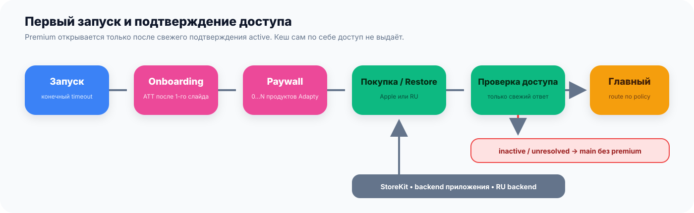
</picture>

`BroadUIFlows` отображает состояние и маршруты, но не объявляет purchase
успешным самостоятельно. `purchase`/`restore`/RU return всегда ведут к новой
entitlement-проверке; только подтверждённый `active` открывает premium.

## Onboarding и ATT

<picture>
  <source media="(prefers-color-scheme: dark)" srcset="Documentation/Assets/README/onboarding-decision-flow-dark.svg">
  <source media="(prefers-color-scheme: light)" srcset="Documentation/Assets/README/onboarding-decision-flow-light.svg">
  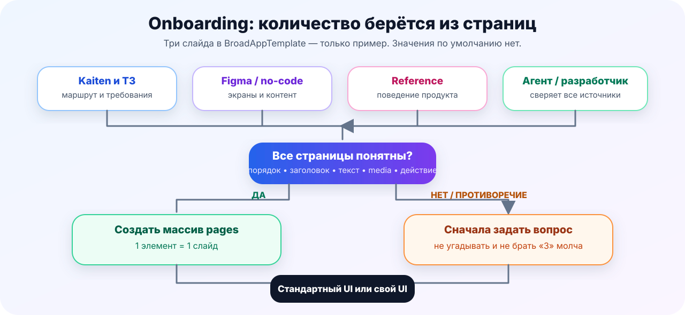
</picture>

- `OnboardingConfiguration.pages` — единственный источник количества слайдов;
- три example-страницы не являются default или лимитом;
- неизвестный контент сначала получает `BLOCKED`, а не fixture из template;
- `BroadOnboardingView` даёт стандартную верстку;
- `BroadOnboardingFlowHost` сохраняет lifecycle/ATT contract для полностью
  app-owned SwiftUI;
- ATT возможен только после фактического появления первого слайда; Rate Us в
  onboarding запрещён.

## Адаптивный paywall

<p align="center">
  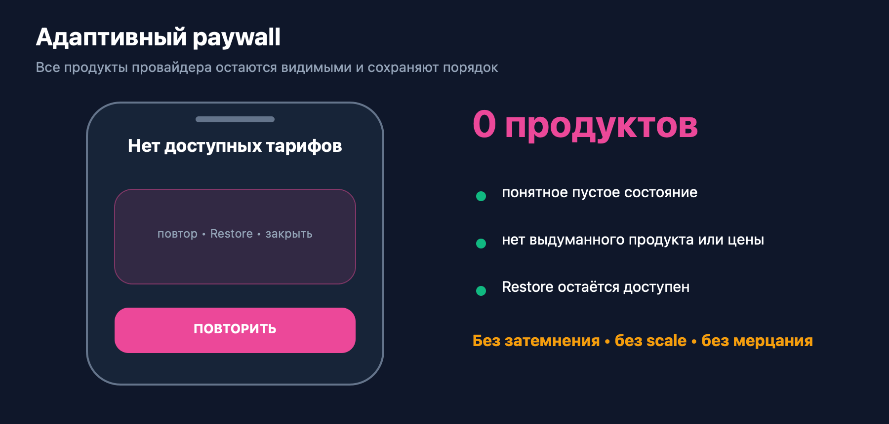
</p>

Один renderer показывает 0, 1 или любое количество provider products. Он не
фильтрует, не сортирует и не объединяет их. Длинные названия и локализованные
цены не должны ломать layout; product list прокручивается, а primary action и
legal actions остаются доступны.

<table>
  <tr>
    <td align="center"><br><strong>0 products</strong></td>
    <td align="center"><br><strong>1 product</strong></td>
    <td align="center">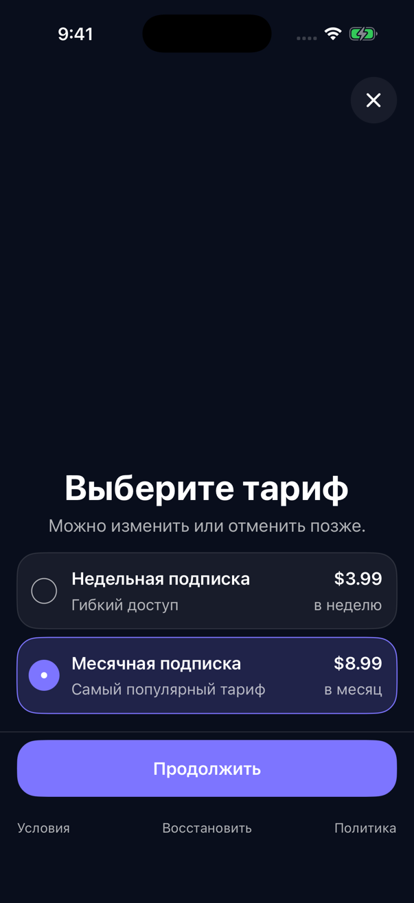<br><strong>2 products</strong></td>
    <td align="center">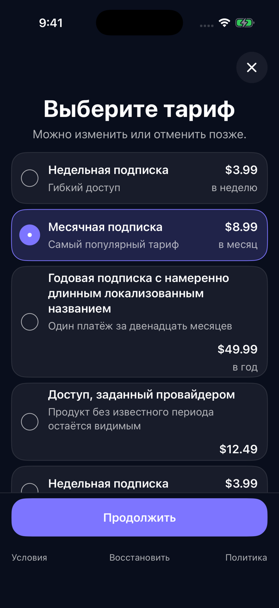<br><strong>N products</strong></td>
  </tr>
</table>

Это fixture-кадры Gallery/Template, а не дизайн host app. Реальные тексты,
assets, products, цены, theme и legal URLs приходят из приложения/provider.

## Loader без моргания

<table>
  <tr>
    <td align="center" width="50%">
      
      <br><strong>Catalog loading</strong>
    </td>
    <td align="center" width="50%">
      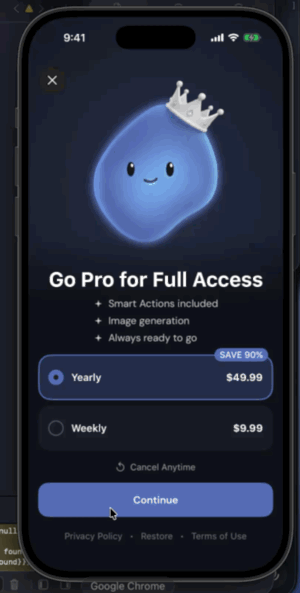
      <br><strong>Purchase loading</strong>
    </td>
  </tr>
</table>

Эталон — поведение, а не конкретная картинка: существующий контент и выбор
остаются под overlay, spinner является отдельным слоем, повторное финансовое
действие блокируется. Карточка не получает `opacity`, `scale`, `brightness` или
pressed effect. Ошибка/timeout снимают loader и дают понятный Retry/Close.

## Special Offer

<table>
  <tr>
    <td align="center" width="50%"><br><strong>1. Первый paywall</strong></td>
    <td align="center" width="50%"><br><strong>2. Offer после close</strong></td>
  </tr>
</table>

Special Offer никогда не заменяет initial paywall. Confirmed purchase/restore
первого экрана обходит downsell; close без покупки запускает resolver, и только
явный `special_offer = true` из Remote Config выбранного paywall плейсмента `main`
разрешает второй экран с products отдельного placement. Countdown идёт
до `expiresAt`, на нуле закрывает экран и не зацикливается. RU-цена
показывается из точной backend-строки `isSpecialOffer = true`.

## Token paywall

<p align="center">
  
</p>

Reference показывает scrollable набор consumable packages и sticky CTA. Число
packages, тексты, изображение, скидка и цены принадлежат конкретному приложению.
UI обновляет balance только после полного backend snapshot, а не после tap или
локального purchase callback.

## RU Billing UI

```text
тариф → способ оплаты → обязательные согласия → email для чека
      → внешняя платёжная форма → backend reconciliation
```

<table>
  <tr>
    <td align="center"><br><strong>Тариф</strong></td>
    <td align="center">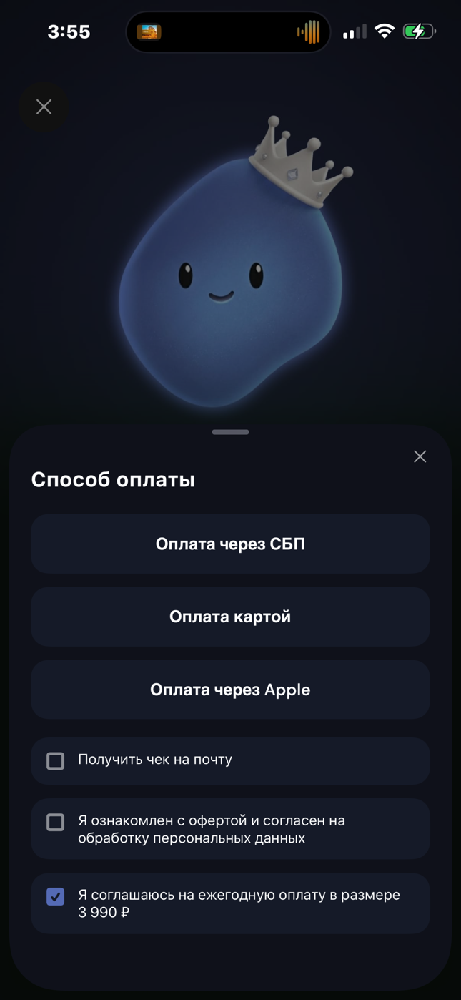<br><strong>Способ</strong></td>
    <td align="center"><br><strong>Согласия</strong></td>
    <td align="center"><br><strong>Чек</strong></td>
  </tr>
</table>

<table>
  <tr>
    <td align="center" width="50%">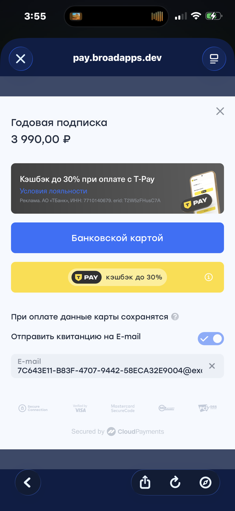<br><strong>Карта</strong></td>
    <td align="center" width="50%">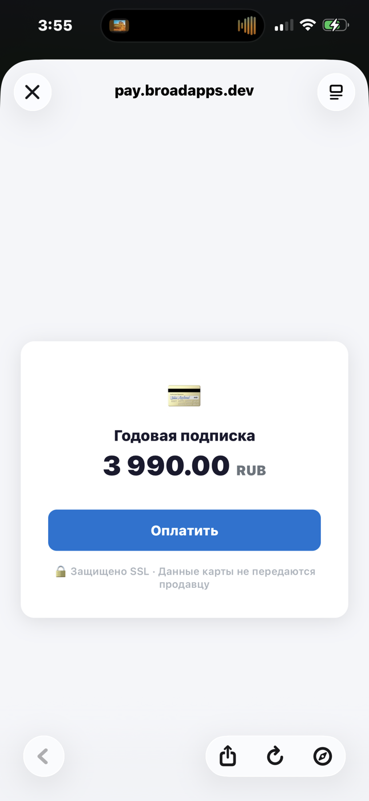<br><strong>Hosted checkout</strong></td>
  </tr>
</table>

Эти кадры — reference последовательности, не обязательный визуальный стиль.
RU UI появляется только после policy из `BroadMonetization`; сам экран не
читает `ru_pay`, регион, язык или backend kill switch и не считает возврат из
браузера подтверждением оплаты.

<details>
<summary><strong>Дополнительные fixture-состояния RU subscription</strong></summary>

<table>
  <tr>
    <td align="center">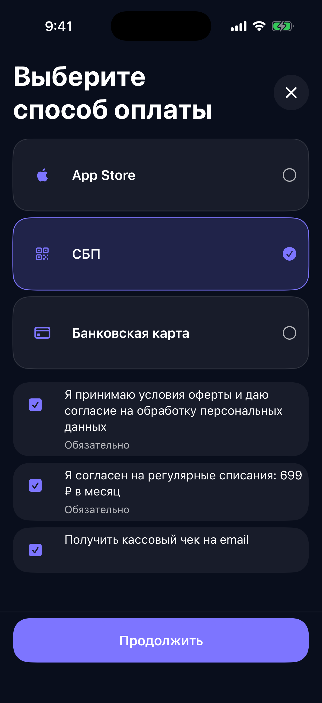<br><strong>Methods</strong></td>
    <td align="center">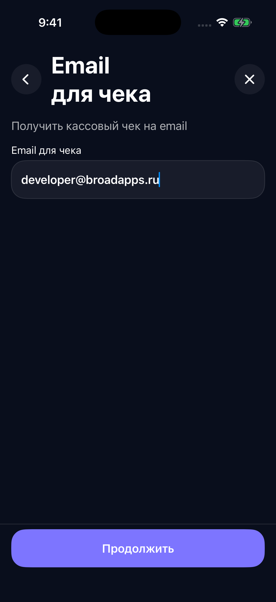<br><strong>Receipt</strong></td>
    <td align="center">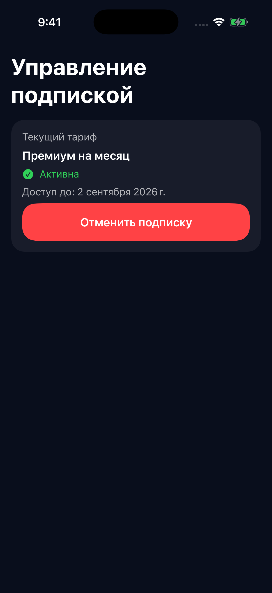<br><strong>Active</strong></td>
    <td align="center">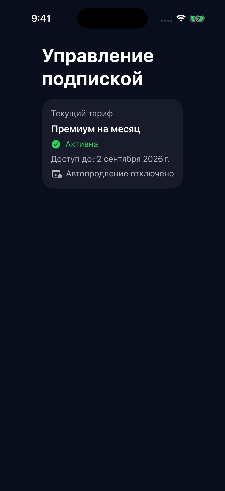<br><strong>Cancelled</strong></td>
  </tr>
</table>

</details>

## Gallery

```bash
bash Scripts/generate_sandbox.sh
open Examples/BroadUIFlowsGallery/BroadUIFlowsGallery.xcodeproj
```

Gallery показывает fixture-only onboarding и библиотеку loadable/UI states.
Financial SDK не активируется, внешние операции не выполняются.

## Проверка

```bash
bash Scripts/check_ui_contracts.sh
bash Scripts/module_gate.sh
```

Gate проверяет структуру/dependencies, docs, format/lint, Swift package,
onboarding/paywall/Special Offer UI-контракты, public API report, Debug/Release
gallery и DocC. `Tests/`, XCTest/Swift Testing и настоящие операции отсутствуют.

## Versioning

Модуль выпускается независимо по SemVer. Additive API — MINOR, совместимое
исправление — PATCH, breaking contract — MAJOR. Проверенная точная комбинация
версий публикуется integration repository и compatibility matrix.

## Documentation

- [Module guide](Documentation/BroadUIFlows.md);
- [DocC landing](Sources/BroadUIFlows/BroadUIFlows.docc/BroadUIFlows.md);
- [Public searchable docs](https://broadapps-ios-docs.nkhsnv.chatgpt.site/docs/broad-ui-flows).

Документы публичны и принимают правки через pull request / `Edit this page`.
